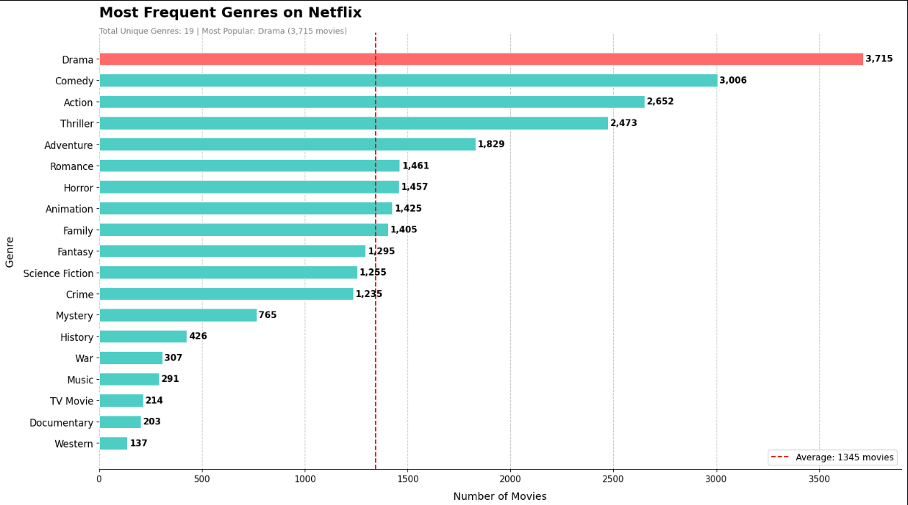
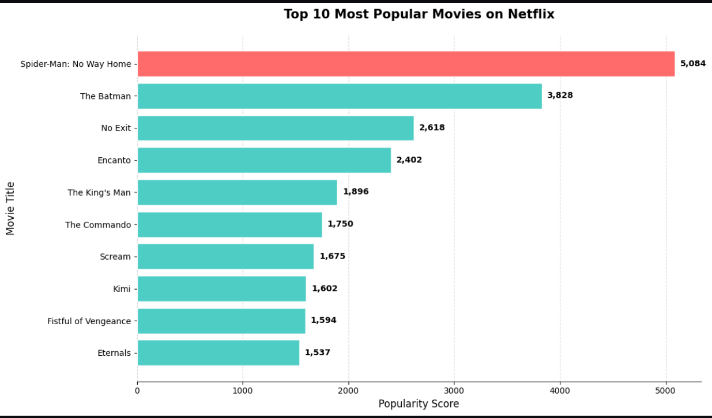
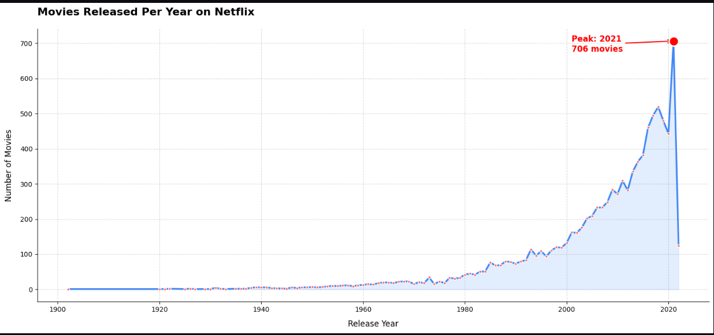
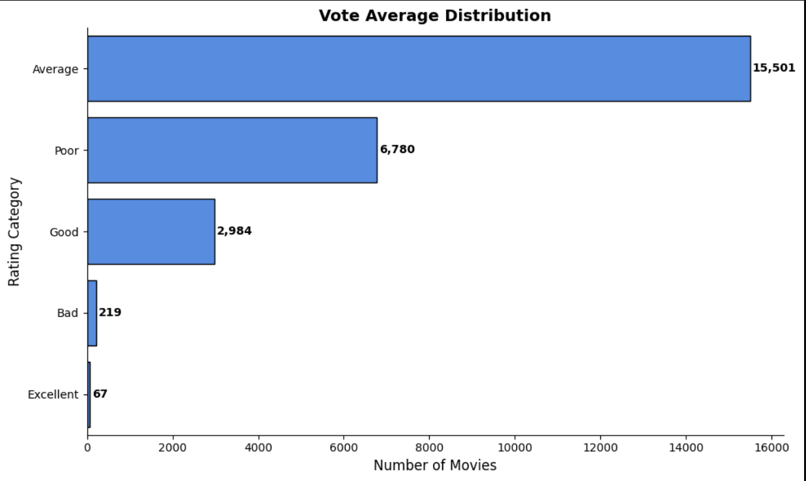

# 🎬 Netflix Data Analysis Project

---

## 📌 Project Overview
This project performs a comprehensive 
Exploratory Data Analysis (EDA) on a 
Netflix movie dataset containing 9,800+ movies.
The goal is to extract meaningful insights 
about movie trends, genres, ratings, 
and popularity on Netflix.

---
---

## 🔗 Quick Links

| Resource | Link |
|:---------|:-----|
| 📓 **Jupyter Notebook** | [View Notebook](https://github.com/yourusername/netflix-data-analysis/blob/main/Netflix_Analysis.ipynb) |
| 📊 **Dataset** | [Download Dataset](https://github.com/yourusername/netflix-data-analysis/blob/main/Netflix_data.csv) |
| 📥 **Raw Dataset** | [Raw CSV](https://raw.githubusercontent.com/yourusername/netflix-data-analysis/main/Netflix_data.csv) |
| 📈 **Excel Report** | [Download Excel](https://github.com/yourusername/netflix-data-analysis/blob/main/Netflix_Full_Analysis.xlsx) |

---
## 🎯 Key Questions Answered
- What is the most frequent genre on Netflix?
- Which movie has the highest popularity?
- Which movie has the lowest popularity?
- Which year had the most movie releases?
- How are movies distributed by vote average?

---

## 📊 Key Insights Discovered

| Insight | Finding |
|:--------|:--------|
| 🥇 Most Popular Movie | Spider-Man: No Way Home (5,084) |
| 📉 Least Popular Movie | The United States vs. Billie Holiday (13.35) |
| 🎭 Most Common Genre | Drama (3,715 movies) |
| 📅 Peak Release Year | 2021 (706 movies) |
| ⭐ Most Common Rating | Average — 15,501 movies (59.4%) |
| 💎 Excellent Movies | Only 67 movies (0.3%) |

---

## 📈 Visualizations

### 🎭 Most Frequent Genres

### 🏆 Top 10 Most Popular Movies

### 📅 Movies Released Per Year

### ⭐ Vote Average Distribution

---

## 🛠️ Technologies Used

| Tool | Purpose |
|:-----|:--------|
| Python 3.9+ | Core programming language |
| Pandas | Data manipulation |
| NumPy | Numerical operations |
| Matplotlib | Data visualization |
| Seaborn | Statistical charts |
| OpenPyXL | Excel export |
| XlsxWriter | Excel charts |

---

## 🔍 Data Cleaning Steps Performed

1. ✅ Loaded raw CSV data
2. ✅ Fixed encoding errors
3. ✅ Handled missing values (0.1% of data)
4. ✅ Converted data types
5. ✅ Removed duplicate records
6. ✅ Extracted Year from Release Date
7. ✅ Split Genre lists into individual rows
8. ✅ Created Vote Category bands
9. ✅ Exported clean data to Excel

---

## 💡 Key Takeaways

> 1. Drama dominates Netflix with 3,715 movies
> 2. Superhero films dominate popularity rankings
> 3. Only 0.3% of movies achieve Excellent ratings
> 4. 2021 was Netflix's peak content year (706 movies)
> 5. Popularity gap between top and bottom is 380x

---

## 🚀 How to Run

### Step 1: Clone the repository
    git clone https://github.com/yourusername/netflix-data-analysis.git

### Step 2: Navigate to project folder
    cd netflix-data-analysis

### Step 3: Install required libraries
    pip install -r requirements.txt

### Step 4: Open Jupyter Notebook
    jupyter notebook Netflix_Analysis.ipynb

---

## 👤 Author

- **Name**    : Shehzad Hussaon
- **GitHub**  : https://www.linkedin.com/in/shehzad-hussain-42a5443ab/skills/edit/forms/new/
- **LinkedIn**: https://www.linkedin.com/in/shehzad-hussain-42a5443ab/skills/edit/forms/new/

---

## 📜 License
This project is licensed under the
MIT License
